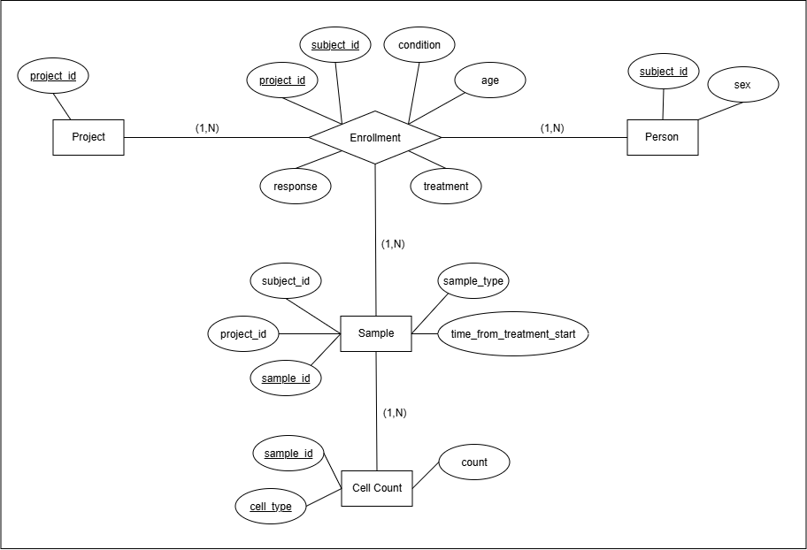

# Teiko — Cell Count Data Pipeline

A small end-to-end pipeline over `cell-count.csv`: load the CSV into a normalized
SQLite database, run the analyses (Parts 2–4), and serve the results in an
interactive dashboard.

**Live dashboard:** https://teiko-mihirkadam19.streamlit.app/

---

## Running the code (GitHub Codespaces)

The `Makefile` has three targets. From the repo root:

```bash
make setup       # install dependencies from requirements.txt
make pipeline    # Part 1 (build DB) + Parts 2–4 (write all output artifacts)
make dashboard   # start the Streamlit server
```

`make pipeline` runs to completion with no manual steps and is safe to re-run —
`load_data.py` drops and recreates the tables each time, so no duplicate rows
accumulate.

### What `make pipeline` produces

| Step | Command | Output |
|---|---|---|
| Part 1 | `python load_data.py` | `cell_counts.db` (SQLite, repo root) |
| Part 2 | `python -m src.analysis.freq_analysis` | `output/part2_frequency_table.csv` |
| Part 3 | `python -m src.analysis.responder_stats` | `output/part3_stats_results.csv`, `output/part3_responder_summary.txt`, `output/part3_boxplot_t0.png`, `output/part3_boxplot_t7.png`, `output/part3_boxplot_t14.png` |
| Part 4a | `python -m src.analysis.subset_analysis` | `output/part4_baseline_subset.csv`, `output/part4_baseline_summary.txt` |
| Part 4b | `python -m src.analysis.avg_bcell` | `output/avg_bcell.txt` |

`cell_counts.db` and `output/` are included as output artifacts.
`make dashboard` works on a fresh checkout without `make pipeline`.

### Headline results (current dataset)

- **Part 2:** 52,500 rows = 10,500 samples × 5 populations.
- **Part 3:** tested per timepoint (t = 0, 7, 14), one row per population ×
  timepoint in `part3_stats_results.csv`. At raw *p* < 0.05: `cd4_t_cell` at
  t = 7 (*p* = 0.030) and `b_cell` at t = 14 (*p* = 0.014); nothing at t = 0.
  Nothing survives a Bonferroni correction across all 15 tests, so these are
  suggestive, not conclusive.
- **Part 4a:** 656 baseline samples / 656 subjects — `prj1` 384, `prj3` 272;
  responders 331, non-responders 325; female 312, male 344.
- **Part 4b:** average baseline B-cell count for melanoma male responders =
  **10206.15**.

---

## Database schema

`cell-count.csv` is one wide row per sample. It is normalized into five tables.

### ER diagram



### Design choices

- **`Person`** represents the unique subject. Has attributes `subject_id` and `sex`. Assuming in future people might register new sample leading to a newer value for age, `age` is not included as an attribute here.
- **`Project`** represents individual projects. Has a single attribute `project_id`.
- **`Enrollment`** is the associative/relationship entity for the many to many between
  `Project` and `Person`. Although, the data doesn't represent the many to many relationship, assuming a many to many relationship leaves room for the possibility that a single subject may get involved in more than one project. If that happens in the future no major schema changes will be required, we can just add a new entry in the `Enrollment ` table. Attribute `age` is mentioned as per earlier assumtion.
  Other atrributes are `condition`,  `treatment`, `response` and Foreign keys (`project_id`, `subject_id`)
- **`Sample`** represents unique sample. Its `(project_id, subject_id)` foreign
  key points at `Enrollment`, so a sample can only exist for a real enrollment. Other attributes containe sample details.
- **`CellCount`** represents the cell count for each sample. Foreign key `sample_id` points to a unique sample, and  `cell_type` & `count` represent the type of cell recorded and its respective count. Even though the data consistently has 5 cell types, this design choice allows for addition of newer cell types without changing the schema.


## How the schema scales

- **`Person`** stores only stable identity attributes (`subject_id`, `sex`), so growth in subject count is just additional rows.
- **`Enrollment`** as a many-to-many join means a `Person` can be linked to any number of `Project`s without altering the schema. At hundreds of projects, this avoids duplicating `Person` records or adding project specific columns. A new enrollment is just a new row keyed on `(project_id, subject_id)`.
- `age` living on `Enrollment` rather than `Person` scales with re-enrollment as a subject who joins a new project years later gets a new, accurate age tied to that specific enrollment, instead of overwriting or duplicating a `Person` level field.
- **`Sample`** keys `(project_id, subject_id)` referencing `Enrollment` guarantees referential integrity as sample volume grows into the thousands. A sample will only exists for a valid enrollment. That means if a subject leaves from the study, there won't be any stray rows.
- **`CellCount`** as a narrow `(sample_id, cell_type, count)` table rather than fixed columns per cell type means adding new cell types is a data insertion problem, not a schema migration problem. This keeps the table narrow, which scales well for write throughput as samples multiply.
- Since the schema is very modular, performing analytics just becomes data handling problem. The schema is very flexible, which means as the data grows, minimal changes will be required. 

---

## Code structure

```
cell-count.csv               raw input
load_data.py                 Part 1: CSV -> SQLite (schema + idempotent load)
Makefile                     setup / pipeline / dashboard / clean
requirements.txt
Teiko_er_diagram.png

src/
  paths.py                   every filesystem path in one place
  helpers.py                 QueryHelper interface + one class per SQL query
  analysis/
    freq_analysis.py         Part 2  runner -> part2_frequency_table.csv
    responder_stats.py       Part 3  Mann-Whitney U per population × timepoint + boxplots
    subset_analysis.py       Part 4a baseline subset breakdowns
    avg_bcell.py             Part 4b average baseline B-cell count
  dashboard.py               Streamlit app (Parts 2-4) — wiring only, no analysis logic

output/                      generated artifacts (git-ignored)
```

### Why it is laid out this way

- **Query & transform are separated.** `helpers.py` owns all SQL
  and returns raw DataFrames. The `analysis/` modules own the statistics,
  formatting, and file writing. This allows developers to write more readable code. Moreover, there is a separation of concerns, problems related to queries and problems related to the data handling/analysis can be addressed and debugged easily.

- **`helpers.QueryHelper` is an interface.** Each query is a class with a
  `_fetch(conn)` method (the SQL) wrapped by `run(conn)`. This makes sure that all the helper functions written to fetch data from the database, i.e. by running SQL queries, follows a consistent structure, which is, provide input parameter `conn` (db connection) and return a pandas framework. This helps new developers to understand already implemented helper functions and makes the code more maintainable as we add more and more analysis. 

- **`analysis` Module** Includes all the runnners. In this case, there are different runners/python programs for each individual analysis. This makes it easier to locate the source code for a specific analysis and makes the code more maintainable. In future, a stricter naming convention can be followed for this.

- **`paths.py`** includes all paths for input and output. Since we are generating a lot of output files, and sometimes output from one analysis could be used by other. So, having them in one place makes it less confusing and more maintainable.


### Statistical choice (Part 3)
We compare responders vs. non-responders separately for each of the 5 cell populations, using the Mann Whitney U test. We run this separately at each of the three sampling timepoints (0, 7, and 14 days from treatment start).

We split the analysis by timepoint because each subject contributes a sample at all three timepoints, and their response label stays the same across all three. If we pooled every timepoint into one test, we would be counting the same subject three times instead of once, which makes the results look more confident than they really are.

This test does not assume the data follows a normal distribution. That is a safe choice since cell percentages are bounded between 0 and 100 and tend to be skewed. It is also not easily thrown off by outliers.

Since we are running 5 populations across 3 timepoints, that is 15 separate tests in total, and there is a higher chance that at least one shows a significant result just by chance. To guard against this, we multiply each p value by 15, capping at 1.0. This is called a Bonferroni correction. It is a conservative way of saying we should trust a result only if it still looks significant even after accounting for the fact that we ran many tests.


### Subset Analysis (Part 4)
Class `BaselineSubset` fetches the baseline subset that identifies all melanoma PBMC samples at baseline (time_from_treatment_start is 0) from patients who have been treated with miraclib. This addresses the first part of the requirement directly.
To address the second part, no additional queries are written since the information can be filtered out directly from the baseline subset via pandas df. This reduces DB calls to just one single call, and is more memory efficient since we are working with just one df.
